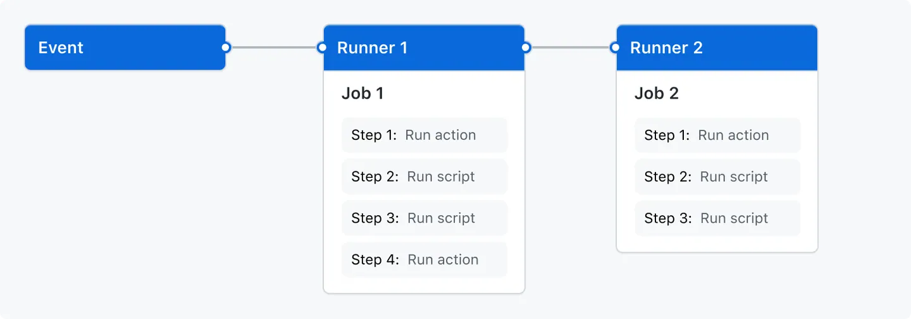

<div class="title-card">
    <h1>Github Actions</h1>
</div>

---

# GitHub Actions

An Action creates an automation for events in repositories.

Run common tasks in repeatable fashion.

---

# Github Actions Marketplace

Contains useful templates for Actions

Community Actions

Create custom actions and upload them to the marketplace

---

# Github Actions (terminology) - I

Event: Triggers that start a workflow

Workflows: Defines an automation from start to finish

Jobs: A workflow contains one or more jobs. A job is one or more steps.

Steps: Simple commands, shell scripts or actions.

Steps can’t run in parallel. Runs in sequence from top to bottom.

---

# Github Actions (terminology) - II

**Runner**: Compute layer where jobs are executed. Each job has its own runner.

Runners can run in parallel.

GitHub provides 3 types of runners: Ubuntu, Windows and MacOS.

Using a self-hosted runner is also possible.

Github runners comes with pre-installed tools, runtimes and compilers that require minimal configuration.

---

# Single Workflow - Overview I



---

# Overview II


---

# Technical requirements:

Workflows must be stored in the .github/workflows folder.

Workflows are defined with YAML.

Workflows must define:

* Trigger and branches 
* Permissions
* Job and runner 
* Steps

---

# Let's do it ourselves from scratch!

Create a new repository. Inside of it:

```bash
$ mkdir .github

$ cd .github

$ mkdir workflow

$ cd workflows
```

Create `hello_world.yaml` in the `workflows` folder.


---

# Hello World workflow

Let's manually create a workflow that echoes (logs) "Hello World" on every push and PR.

1. Create a new repository. 

2. Create .github/workflows

3. In it, create a file called hello_world.yaml

---

# In hello_world.yaml


```yaml
name: Hello world workflow

on:
  push:
    branches: [main]
  pull_request:
    branches: [main]

jobs:
  hello:
    runs-on: ubuntu-latest
    steps:
      - name: Run hello world
        run: echo "Hello world"
        shell: bash
```

---

<div class="exercise-card">
    <h1>Exercise - Create a job named goodbye</h1>
</div>

It should echo `goodbye` after the hello job has run. 

Reminder: Never rerun the checkout action if a previous job has done that.

